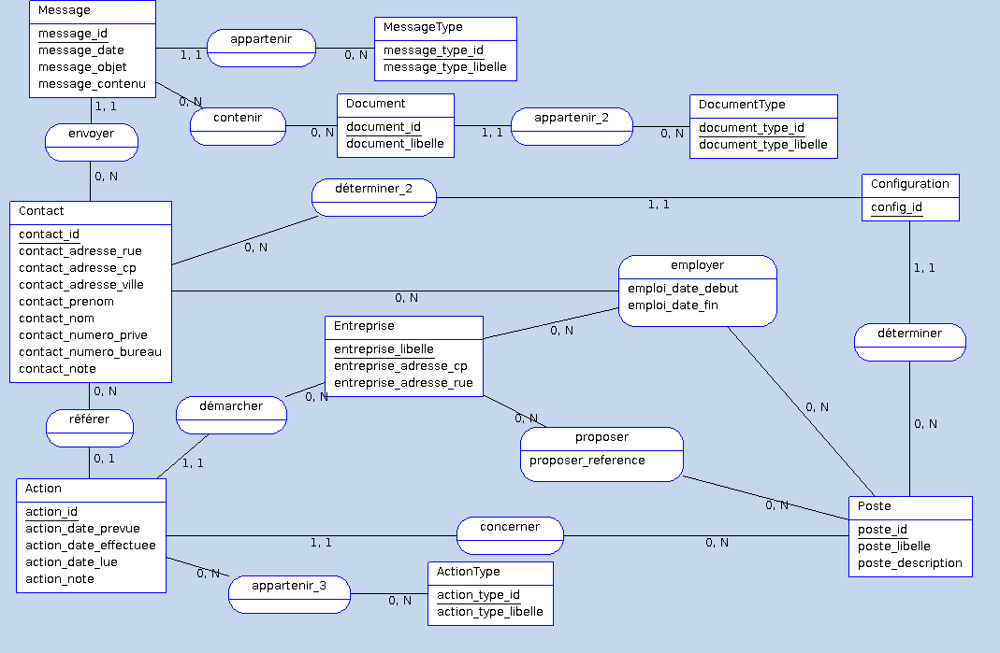

[Index](index.html)

# Conception de la solution

Le présent document explique en partie le schéma suivant : 

## Entreprise

Une entreprise possède : 

  * une enseigne (nom de l'entreprise)
  * une adresse postale (rue, CP, ville)
  * une description
  * un historique
  * un site web principal
  * un numéro de téléphone
  * un numéro de fax
  * une adresse courriel

## Poste

1 poste est lié de 0 à plusieurs entreprises.

Un poste possède : 

  * un intitulé

## Contact

Si aucun contact, on envoie un message à l'adresse de la Société.

Un contact possède : 

  * un nom
  * un prénom
  * un numéro de téléphone
  * un numéro de téléphone privé
  * une adresse courriel
  * une adresse courriel privée
  * une entreprise (Entreprise)
  * une fonction (au sein de l'entreprise)

## Canal (Type de message)

Un canal possède : 

  * un nom
  * une description

On dénote les canaux suivants : 

  * appel téléphonique
  * courrier postal
  * message électronique
    * courriel
    * messagerie instantanée
    * site web, forum
    * réseau social
  * texto

## Message

Un message possède :

  * un objet
  * un contenu
  * un canal (Canal)

## Action

Une action possède : 

  * une date prévue
  * une date où l'action est effectuée
  * une description de l'action
  * un type d'action parmi : 
    * relance
    * initial (premier contact)
    * RDV
    * contact
    * réponse

## Type d'action

Un type d'action possède : 

  * un nom (relance, intial, rdv, etc.)
  * un usage (une description de ce pourquoi le type d'action est fait)
  * une séquence (pour l'ordre dans laquelle on effectue généralement les étapes)

## Document

Un document possède : 

  * un nom
  * une description
  * un fichier lié
  * un état (brouillon, valide, obsolète)

## Type de document

Un type de document possède : 

  * un nom (CV, lettre de motivation, etc.)
  * une description

## Notes diverses

### Table configuration

La table configuration permet de déterminer un poste par défaut et un contact par défaut.

Par exemple pour effectuer une action d'envoi de candidature spontanée dans une entreprise, il faut avoir un poste par défaut nommé "Ingénieur logiciel" (que l'utilisateur doit définir) et un contact par défaut "Direction des Ressources Humaines" pour l'envoi d'un message.

### Séquence des types d'action

En ajoutant une séquence aux actions, on permet au logiciel de proposer à défaut une action à effectuer sur les entreprises non contactées ou sans actions liées !

### Validation d'une action

Le bouton "Effectuer l'action" permet de créer un message qui reprend l'entreprise en destinataire et cherche le dernier contact reçu ou bien le contact par défaut pour cette entreprise.

### Messages

L'envoi / réception de message s'effectue correctement de la manière suivante : 

  * un message est envoyé à 1 et un seul contact
  * un contact nous envoie une réponse (action de type réponse à une date effectuée précise).

### Action

La liste des actions à afficher sur le tableau de bord sont : 

  * les actions sans aucune date
  * les actions sans date_effectuee (qu'importe si prévue ou non)
  * les actions de type relance avec une date\_effectuee mais avec date\_lue non renseignée

action_note : contient les remarques sur l'action.
